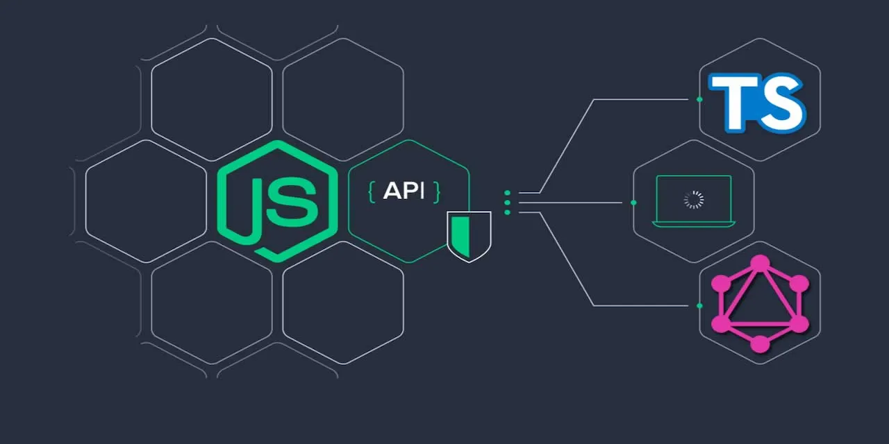

---

<h1>This project demonstrates how to integrate Node.js (Express and Apollo/GraphQL) with OpenSearch using Docker containers. </h1>
---

## Features

- **OpenSearch**: A container running OpenSearch to provide a powerful, scalable search engine.
- **Node.js (Express)**: Provides RESTful APIs for querying data from OpenSearch.
- **Node.js (Apollo/GraphQL)**: Utilizes GraphQL for more flexible querying of OpenSearch data.
- **Python Data Loader**: Initializes OpenSearch with preloaded music data.
- **Simple Linux Container**: Provides access to file systems and logs for debugging purposes.
- **Docker Compose**: Orchestrates all the containers for seamless integration.

## Quick Start


```bash
gh repo clone bygregonline/graphql-express-opensearch-docker-tutorial
cd graphql-express-opensearch-docker-tutorial
docker bu
docker compose -p stack  up -d


```


-----


</br>
</br>


VOILA thats all you need to do

---

if you want to stop
docker compose down


---

** I DON'T KNOW HOW TO MAKE IT WORK ON WINDOWS AND I DON'T CARE TO INVESTIGATE IT.


** A beerware software